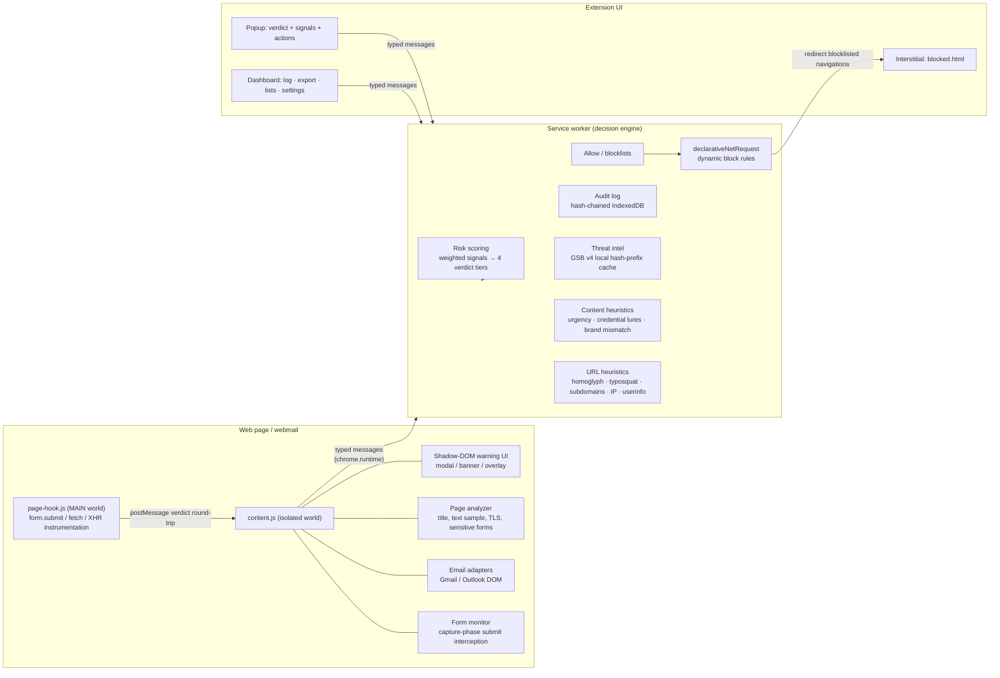

# PhishGuard 🛡

A production-grade, privacy-respecting anti-phishing browser extension (Manifest V3, Chrome/Edge).
PhishGuard detects phishing websites and webmail messages in real time, **intercepts risky form
submissions before credentials leave the page**, explains *why* something was flagged in plain
language, and keeps a tamper-evident local audit log.

**All analysis happens on your device. No telemetry. No data leaves your machine** unless you
explicitly export it.

---

## Features (v1.0)

| Area | Capability |
|---|---|
| URL analysis | Homoglyph/punycode (IDN) detection, typosquat distance against a bundled brand list, brand-in-subdomain nesting (`paypal.com.secure-login.evil.tk`), IP-literal hosts, userinfo tricks (`https://paypal.com@evil.tld`), suspicious TLDs, URL-shortener flagging |
| Sensitive forms | Password, payment-card, OTP, SSN, and seed-phrase fields detected via input types, `autocomplete` attributes, and name/label heuristics — including dynamically injected forms (debounced MutationObserver) |
| Submission interception | Capture-phase `submit` hook **before any network request**, plus MAIN-world instrumentation of `form.submit()`, `fetch()`, and `XMLHttpRequest` for credential-shaped POSTs |
| Destination checks | Page-origin vs. effective action-origin mismatch, HTTPS→HTTP downgrade, action to raw IP or link shortener, `formaction` overrides |
| Threat intel | Google Safe Browsing (Update API v4) with a **local hash-prefix cache** — full URLs are never sent anywhere; plus opt-in **PhishTank / OpenPhish / URLhaus / generic enterprise** URL-list feeds, downloaded periodically and matched entirely on-device; offline-tolerant |
| Domain age | Cached RDAP lookups flag freshly registered domains (< 30 days), consulted only for already-suspicious pages |
| Webmail inspection | Gmail, Outlook Web, and Yahoo Mail adapters plus a generic Roundcube/Zimbra adapter: display-name vs. address mismatch, reply-to divergence, link-text vs. href mismatch with in-message highlighting, risky attachment names (names only — contents are never read) |
| Password-reuse guard | Warns when a password you're submitting was previously used on a different origin — stored as salted hashes only, never plaintext |
| Education | Just-in-time "How does this scam work?" cards in the blocking modal, plus a full techniques library in the dashboard |
| Content heuristics | On-device urgency/pressure language, credential solicitation, payment/gift-card lures, brand keyword + off-brand domain pairing |
| Risk scoring | Weighted signals → **Safe / Suspicious / High Risk / Confirmed Malicious**, with configurable weights and thresholds |
| Protection | Hard-block interstitial for blocklisted domains (declarativeNetRequest, before page render); blocking pre-submit modal for Suspicious & High Risk destinations showing exactly where the data would go (cancel is default); typed-phrase override for Confirmed Malicious |
| Audit log | Append-only, **hash-chained** IndexedDB log of detections, blocks, overrides, TI hits, and flagged visits; survives restarts; tampering is detectable |
| Dashboard | Activity/verdict/top-domain **charts**, log search/filter/stats, integrity verification, CSV/JSON export, allowlist/blocklist management (mutually exclusive lists), sensitivity & feed settings |
| UX | Toolbar badge per-page verdict, plain-language explanations, banner anti-fatigue (one banner per origin per 6 h — enforcement happens at submit time instead), keyboard-navigable & ARIA-labelled UI, dark-mode & reduced-motion aware |

## Installation

### Load unpacked (development)

```bash
npm install
npm run build        # produces dist/
```

1. Open `chrome://extensions` (or `edge://extensions`).
2. Enable **Developer mode**.
3. Click **Load unpacked** and select the `dist/` folder.

### Store packaging

```bash
npm run build
cd dist && zip -r ../phishguard-1.0.0.zip . && cd ..
```

Upload `phishguard-1.0.0.zip` to the Chrome Web Store / Edge Add-ons dashboard.
Consider flipping `minify: true` in `build.mjs` for release builds, and replace the
generated placeholder icons in `public/icons/` with real artwork.

### Development workflow

```bash
npm run watch        # rebuild on change
npm test             # vitest unit/integration suite
npm run typecheck    # strict TypeScript
```

## Architecture



**Flow for a form submission:** the form monitor sees the capture-phase `submit` event,
calls `preventDefault()` immediately, asks the service worker for a verdict (URL heuristics on
the *effective* action URL + cross-origin checks + lists + threat intel), and:

- **Safe / Suspicious** → re-fires the submission via the isolated world's pristine native
  `form.submit()` (Suspicious is logged).
- **High Risk** → blocking modal listing every triggered signal; *Go back* is the default and
  focused action.
- **Confirmed Malicious** → same modal, but overriding requires typing a confirmation phrase;
  every override is written to the audit log.

Programmatic submissions are funneled into the same path: the MAIN-world hook rewrites
`HTMLFormElement.prototype.submit` to `requestSubmit()` (which fires a cancelable event), and
holds credential-shaped `fetch`/XHR POSTs until the isolated world returns a verdict.

## Permissions (and why)

| Permission | Why it is needed |
|---|---|
| `storage` | Settings, allow/blocklists, threat-intel hash-prefix cache |
| `declarativeNetRequest` | Block navigations to blocklisted domains *before* the page renders |
| `alarms` | Periodic threat-feed refresh and audit-log retention pruning |
| `<all_urls>` (host) | Phishing pages can live anywhere; content scripts must run on every page to inspect forms and URLs. No page data is transmitted anywhere. |

PhishGuard deliberately requests **no** `webRequest`, `cookies`, `history`, `downloads`, or
`nativeMessaging` permissions, uses a strict CSP (`script-src 'self'`), ships no remote code,
and renders page/email-derived strings via `textContent` only (never `innerHTML`).

## Threat-feed configuration

### Google Safe Browsing (shipped in v1.0)

1. Create an API key in Google Cloud Console and enable the **Safe Browsing API**.
2. Open the PhishGuard dashboard → **Settings** → paste the key into *Google Safe Browsing API key*.
3. The local hash-prefix database refreshes every 30 minutes (chrome.alarms).

Privacy: matching is done against locally cached 4-byte SHA-256 prefixes. Only when a local
prefix matches does PhishGuard call `fullHashes:find` — sending **hash prefixes only**
(k-anonymity); the full URL is never transmitted. Without a key, or offline, the feed silently
disables itself and heuristics continue to work.

### URL-list feeds: PhishTank, OpenPhish, URLhaus, enterprise

All four are **disabled by default** (each one downloads a third-party list periodically) and
toggled in Dashboard → Settings:

- **PhishTank** — verified phishing URLs. Works without a key; register a PhishTank app key
  for higher rate limits and paste it in settings.
- **OpenPhish** — community feed (`feed.txt`), refreshed on the same 30-minute alarm.
- **URLhaus** (abuse.ch) — active malware-distribution URLs.
- **Enterprise / generic** — point it at any endpoint returning a URL list: plain text
  (one URL per line, `#` comments allowed), a JSON array of strings, or a JSON array of
  `{ "url": … }` objects (covers MISP exports and most SOC blocklist endpoints). An optional
  API key is sent as a `Bearer` token.

Privacy: feed contents are stored as truncated salted-free SHA-256 hashes and matched
**locally** — no per-URL queries are ever sent to these providers. Entries whose path is `/`
block the whole host; full-path entries match exactly. A failed refresh keeps the previous
cache (offline-tolerant).

### Domain age (RDAP)

When a page or form destination already shows at least one suspicion signal, PhishGuard asks
`rdap.org` for the domain's registration date; domains younger than 30 days add a weighted
signal. Results are cached for 30 days (failures for 1 day), and lookups never happen for
ordinary, signal-free browsing — so your normal history is not revealed to RDAP servers.
Toggle in Dashboard → Settings → Heuristics.

## Audit log & tamper evidence

Every security event (detection, blocked submission, blocked navigation, override, TI hit,
flagged visit, report) is appended to IndexedDB with:

```
seq · timestamp · type · domain · url · verdict · score · signals[] · userDecision · prevHash · hash
```

`hash = SHA-256(prevHash ‖ canonical-JSON(record))`. Editing, deleting, or reordering any record
breaks every subsequent link; **Dashboard → Verify log integrity** walks the chain and reports
the first broken record. A privacy mode stores `sha256:<hex>` domain hashes instead of
plaintext domains. Export as CSV or JSON from the dashboard; retention is configurable.

## Privacy policy

- All detection logic runs locally in your browser.
- No analytics, telemetry, crash reporting, or "phone home" of any kind.
- Threat-intel lookups send only partial hashes (k-anonymity), and only when you configure a key.
- The audit log lives in your browser profile and leaves it only via your explicit export.
- Email inspection reads only the message DOM already rendered in your webmail tab; attachment
  *contents* are never read — only file names.
- The password-reuse guard never sees plaintext leave the page context: the content script
  hashes the password (SHA-256), and the background salts and re-hashes both the digest and the
  origin before storage. The store reveals neither passwords nor browsing history.

## Testing

```bash
npm test
```

Covers: URL heuristics (homoglyph/punycode/typosquat/subdomain/IP/userinfo/shortener cases),
the scoring engine and threshold tiers, hash-chain log integrity (tamper/delete/forge
detection), Safe Browsing canonicalization + caching + offline tolerance, and sensitive-form
detection / effective-action resolution against bundled benign & simulated-phishing HTML
fixtures (`tests/fixtures/`).

## Firefox

See [BROWSER_COMPAT.md](BROWSER_COMPAT.md).

## Project layout

```
src/
  core/         scoring engine, URL & content heuristics, brand list, confusables
  intel/        threat-intel adapters (Safe Browsing v4) + URL canonicalization
  storage/      settings, allow/blocklists, hash-chained audit log
  background/   service worker (decision engine, badge, DNR rules, alarms)
  content/      form monitor, MAIN-world hook, email adapters, in-page warning UI
  ui/           popup, dashboard, interstitial logic
public/         manifest.json, HTML/CSS, icons
tests/          vitest suite + HTML fixtures
```
